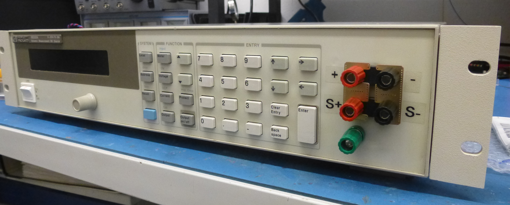

HP 66332A and HP 6632B-6634B Frontpanel Binding Post PCB
===================
This repository contains the schematics for a PCB to mount frontpanel binding post on an HP 6632B (and siblings) power supply. It is an adaption of the original A4 PCB used in option #020 units.

In contrast to the original option #20 PCB, this board breaks out the sense connections as well and also the chassis ground. This makes connecting multiple HP 663xB in parallel possible. On the downside, this requires connecting the sense pins externally. To make this easier I also made a small shorting bar. I will link this in later.

The components chosen allow the board to be used on all variants of the HP 663xB family - even the 100 V 6634B. A variety of different binding posts can be used. There are HP/Agilent versions available on Ebay. I used Pomona 4243-0 ([Digikey](https://www.digikey.de/product-detail/de/pomona-electronics/4243-0/501-1126-ND/604321)) and 3760-5 ([Digikey](https://www.digikey.de/product-detail/de/pomona-electronics/3760-5/501-1506-ND/736554)) binding posts.

The final result looks like this:

About
-----
The root folder contains the KiCAD files and the bill of materials, while the gerber files can be found in the [/gerber](gerber/) folder.

Related Repositories
--------------------

See the following repositories for more information

KiCAD schematic libraries: https://github.com/PatrickBaus/KiCad-libraries

License
-------

This work is released under the Cern OHL v.1.2
See www.ohwr.org/licenses/cern-ohl/v1.2 or the included LICENSE file for more information.
